  

  
  
  
  
  

### Привет! Я Илья 👋

**1С-разработчик с 2+ годами практики.** Дорабатываю учётные системы, связываю 1С с внешними сервисами и превращаю ручные операции в понятные автоматизированные процессы.

- 🧩 Доработка типовых и нетиповых конфигураций 1С
- 🔌 REST/HTTP-интеграции, обмены и внешние обработки
- 🤖 ИИ-инструменты для разработки и автоматизации
- 🛠️ Git-процессы, диагностика и поддержка внедрений

### Избранные проекты

| Проект | Что внутри |
|---|---|
| [**Mini AI 1C**](https://github.com/hex1c-oss/mini-ai-1c) | Десктопный ИИ-ассистент рядом с Конфигуратором 1С |
| [**FuryAI**](https://github.com/hex1c-oss/AGENT-FuryAI-) | Автономный coding-agent на Python |
| [**git-1c**](https://github.com/hex1c-oss/git-1c) | Эксперименты с Git внутри экосистемы 1С |

  

  

Открыт к интересным задачам по 1С, интеграциям и автоматизации.

